::: background-callout
NCLIM brings together an interdisciplinary network of research scientists, oceanographers, ecosystem modelers, economists, and fisheries biologists across leading academic and government institutions.
:::

## University of Maine {.background-heading}

::::::::::::::::: card-grid-4
:::: {.card .text-center .shadow-sm}
::: card-body
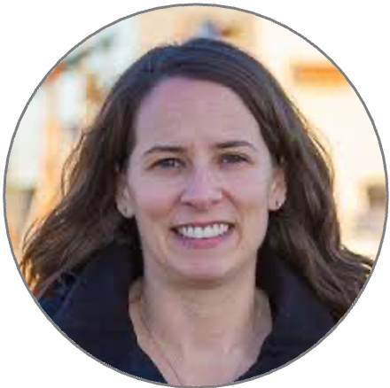

### Lisa Kerr

*Professor*\
[Lisa.kerr1\@maine.edu](mailto:lisa.kerr1@maine.edu)
:::
::::

:::: {.card .text-center .shadow-sm}
::: card-body
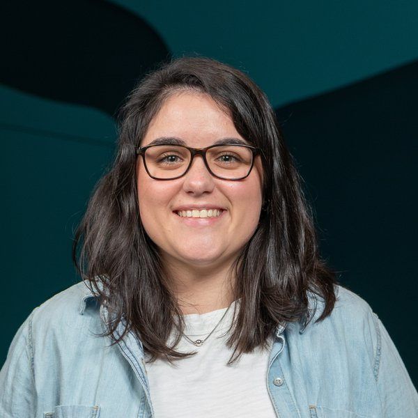

### Jerelle Jesse

*PhD Graduate Student*\
[Jerelle.Jesse\@maine.edu](mailto:Jerelle.Jesse@maine.edu)
:::
::::

:::: {.card .text-center .shadow-sm}
::: card-body
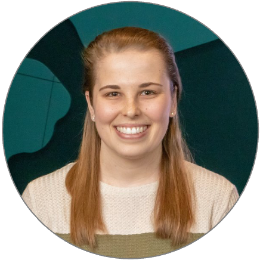

### Jamie Behan

*Research Associate*\
[Jamie.behan\@maine.edu](mailto:jamie.behan@maine.edu)
:::
::::

:::: {.card .text-center .shadow-sm}
::: card-body
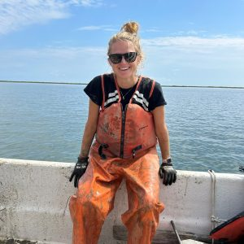

### Alexandra Schneider

*Postdoctoral Research Associate*\
[Alexandra.schneider\@maine.edu](mailto:alexandra.schneider@maine.edu)
:::
::::

:::: {.card .text-center .shadow-sm}
::: card-body
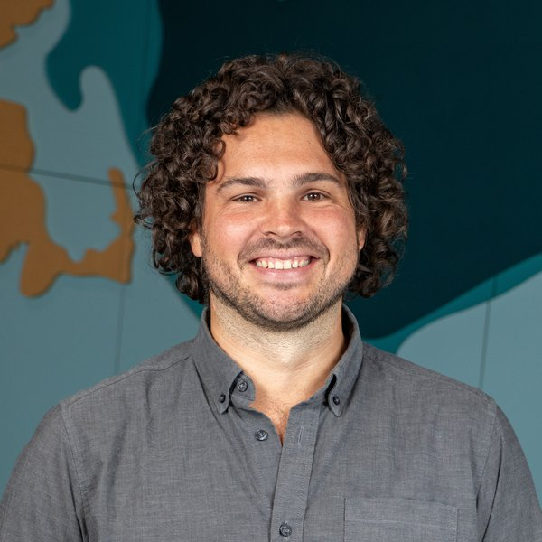

### Roger Brothers

*Assistant Research Professor of Fisheries Science*\
[John.brothers\@maine.edu](mailto:John.brothers@maine.edu)
:::
::::

:::: {.card .text-center .shadow-sm}
::: card-body
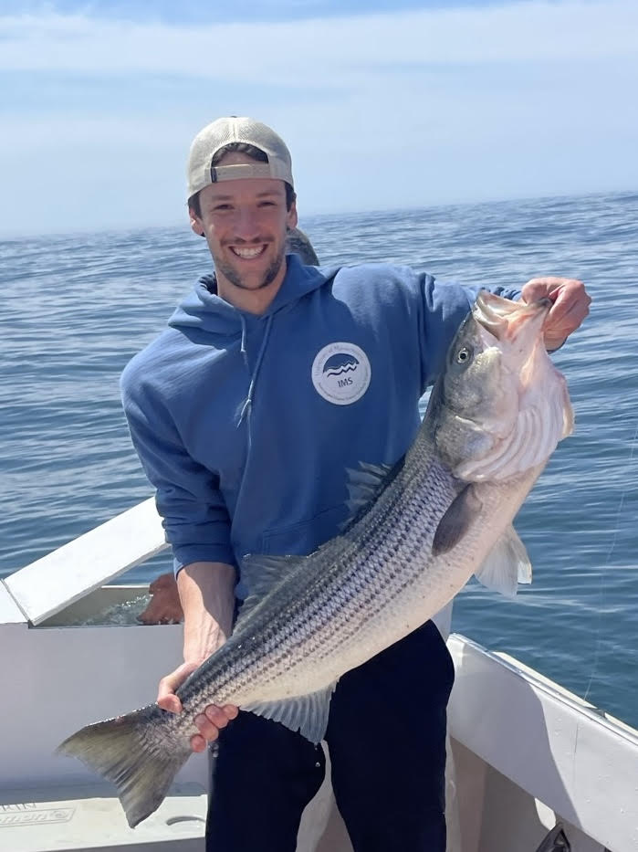

### Cole Carrano

*Postdoctoral Research Associate*\
[Cole.Carrano\@maine.edu](mailto:Cole.Carrano@maine.edu)
:::
::::

:::: {.card .text-center .shadow-sm}
::: card-body
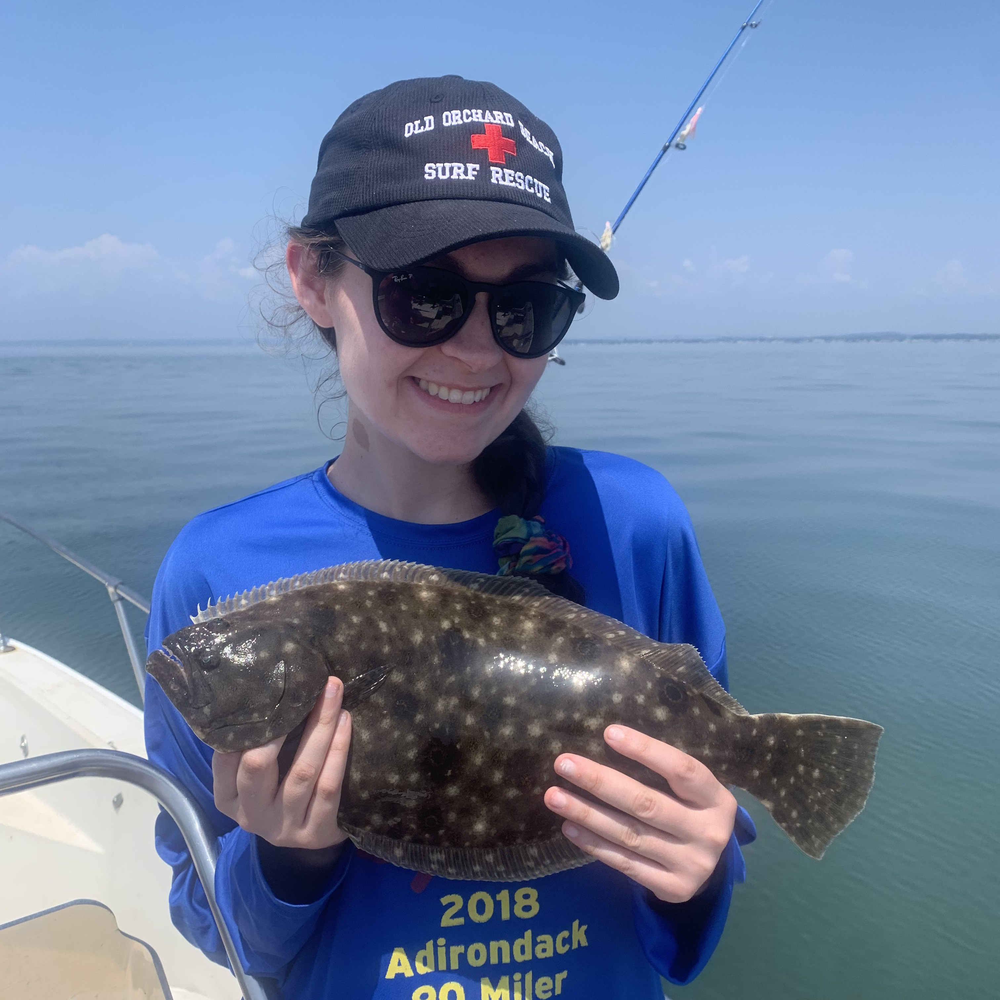

### Hannah Jacobs

*Master's Graduate Student*\
[Hannah.Jacobs\@maine.edu](mailto:Hannah.Jacobs@maine.edu)
:::
::::
:::::::::::::::::

------------------------------------------------------------------------

## NOAA Fisheries {.background-heading}

::::::::::::::::: card-grid-4
:::: {.card .text-center .shadow-sm}
::: card-body
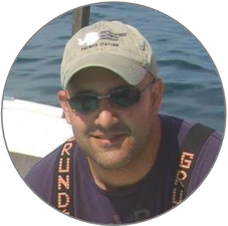

### Vince Saba

*Research Fishery Biologist*\
[Vincent.Saba\@noaa.gov](mailto:Vincent.Saba@noaa.gov)

:::
::::

:::: {.card .h-75 .text-center .shadow-sm}
::: card-body
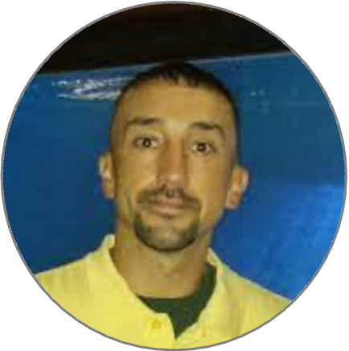

### Jon Deroba

*Research Fishery Biologist*\
[Jonathan.deroba\@noaa.gov](mailto:jonathan.deroba@noaa.gov)

:::
::::

:::: {.card .h-75 .text-center .shadow-sm}
::: card-body

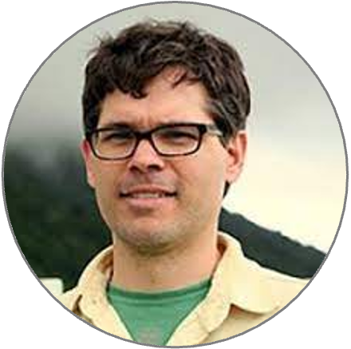

### Tim Miller

*Research Fishery Biologist*\
[Timothy.j.miller\@noaa.gov](mailto:timothy.j.miller@noaa.gov)

:::
::::

:::: {.card .h-75 .text-center .shadow-sm}
::: card-body

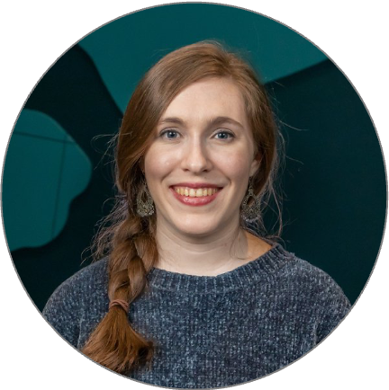

### Amanda Hart

*Fish Biologist*\
[Amanda.hart\@noaa.gov](mailto:amanda.hart@noaa.gov)
:::
::::

:::: {.card .h-75 .text-center .shadow-sm}
::: card-body

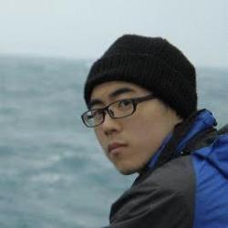

### Chengxue Li

*Postdoctoral Research Associate (Affiliate)*\
[Chengxue.li\@noaa.gov](mailto:chengxue.li@noaa.gov)
:::
::::

:::: {.card .h-75 .text-center .shadow-sm}
::: card-body
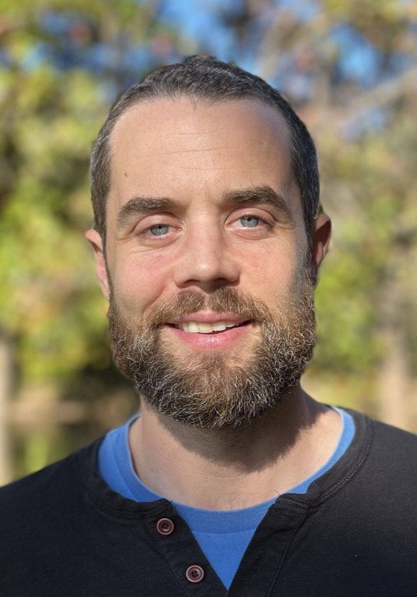

### Greg Britten

*Assistant Scientist I*\
[gregory.britten\@whoi.edu](mailto:gregory.britten@whoi.edu)
:::
::::

:::: {.card .h-75 .text-center .shadow-sm}
::: card-body
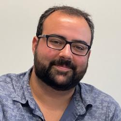

### Joe Caracappa

*Research Fish Biologist*\
[joseph.caracappa@noaa.gov](mailto:joseph.caracappa@noaa.gov)

:::
::::

:::: {.card .h-75 .text-center .shadow-sm}
::: card-body
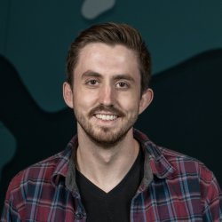

### Alex Hansell

*Fish Biologist*\
[alex.hansell@noaa.gov](mailto:alex.hansell@noaa.gov)

:::
::::

:::: {.card .h-75 .text-center .shadow-sm}
::: card-body
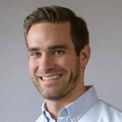

### Scott Large

*Supervisory Research Fishery Biologist*\
[scott.large@noaa.gov](mailto:scott.large@noaa.gov)
:::
::::

:::: {.card .h-75 .text-center .shadow-sm}
::: card-body
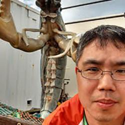

### Min-Yang Lee

*Economist*\
[min-yang.lee@noaa.gov](mailto:min-yang.lee@noaa.gov)

:::
::::

:::: {.card .h-75 .text-center .shadow-sm}
::: card-body
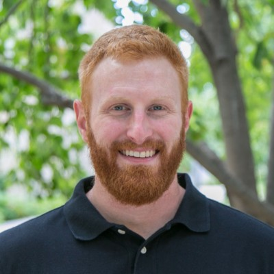

### Matt Cutler

*Social Scientist*\
[matthew.cutler@noaa.gov](mailto:matthew.cutler@noaa.gov)

:::
::::

:::: {.card .h-75 .text-center .shadow-sm}
::: card-body
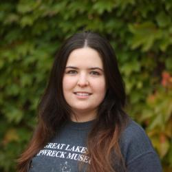

### Emily Liljestrand

*Fish Biologist*\
[emily.liljestrand@noaa.gov](mailto:emily.liljestrand@noaa.gov)

:::
::::

:::: {.card .h-75 .text-center .shadow-sm}
::: card-body
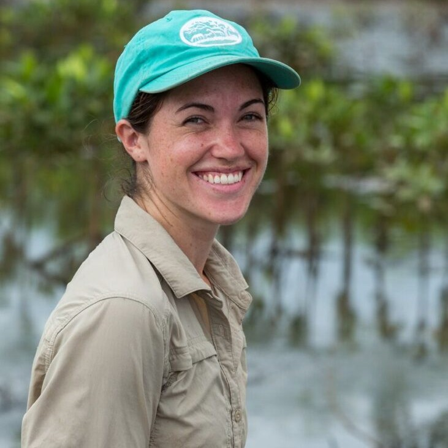

### Kiera Morrill

*Fisheries Social Scientist (Affiliate)*\
[kiera.morril@noaa.gov](mailto:kiera.morril@noaa.gov)

:::
::::
:::::::::::::::::

------------------------------------------------------------------------

## Gulf of Maine Research Institute (GMRI) {.background-heading}

::::::::::::::::: card-grid-4
:::: {.card .text-center .shadow-sm}
::: card-body
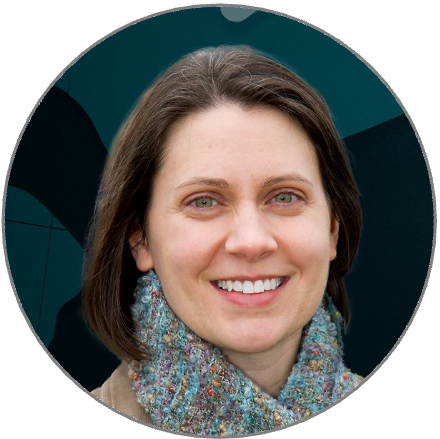

### Kathy Mills

*Supervisory Research Fishery Biologist*\
[scott.large@noaa.gov](mailto:scott.large@noaa.gov)

:::
::::

:::: {.card .h-75 .text-center .shadow-sm}
::: card-body
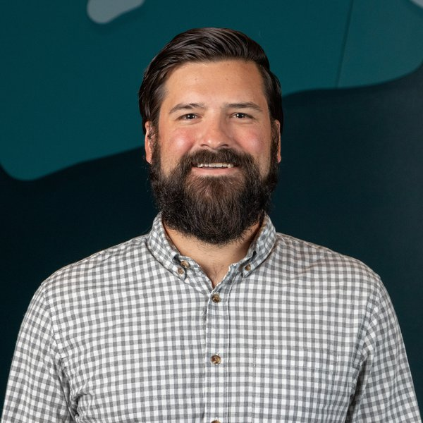

### Andrew Allyn

*Senior Research Manager*\
[aallyn@gmri.org](mailto:aallyn@gmri.org)

:::
::::

:::: {.card .h-75 .text-center .shadow-sm}
::: card-body
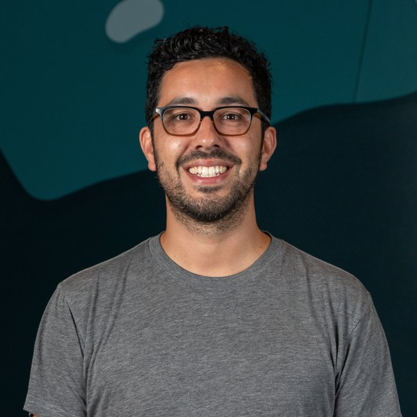

### Miguel Barajas

*Quantitative Research Associate*\
[mbarajas@gmri.org](mailto:mbarajas@gmri.org)

:::
::::

:::: {.card .h-75 .text-center .shadow-sm}
::: card-body
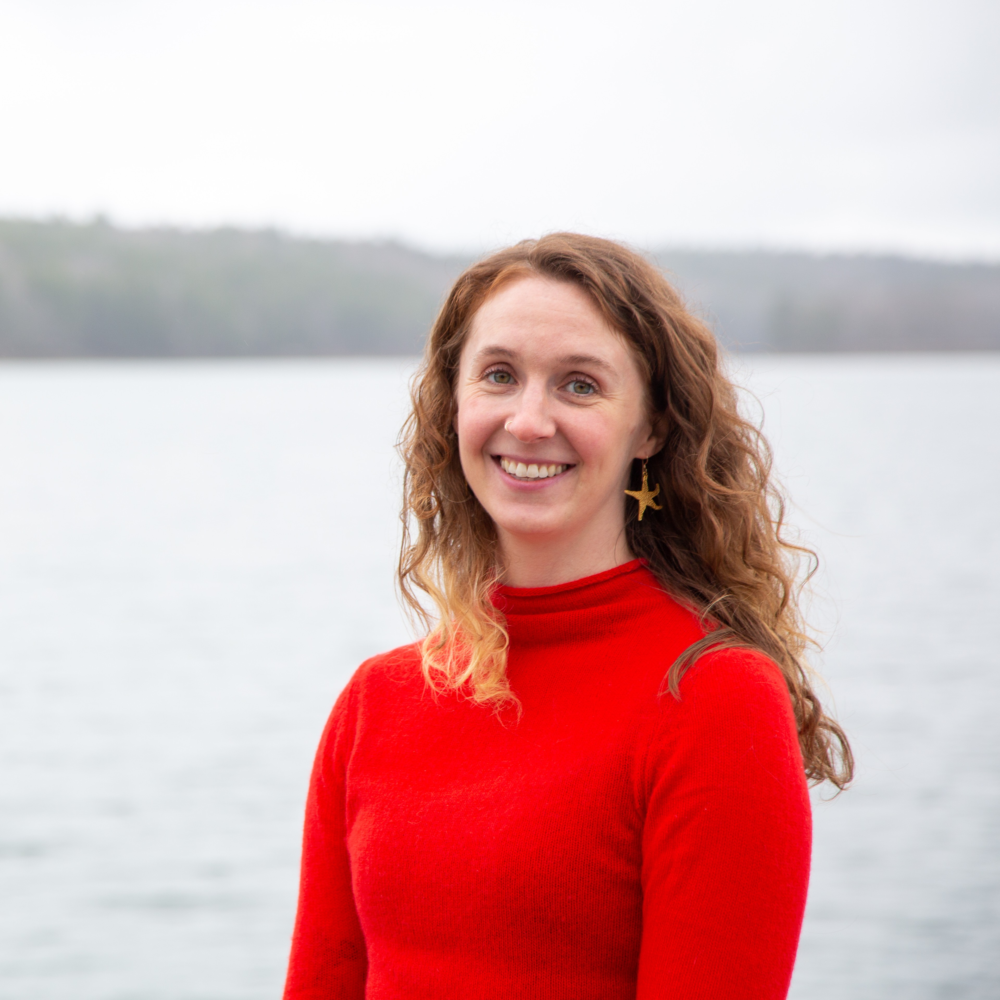

### Sarah Risley

*Postdoctoral Research Associate*\
[srisley@gmri.org](mailto:srisley@gmri.org)

:::
::::
:::::::::::::::::

------------------------------------------------------------------------

## Rutgers University {.background-heading}

::::::::::::::::: card-grid-4
:::: {.card .text-center .shadow-sm}
::: card-body
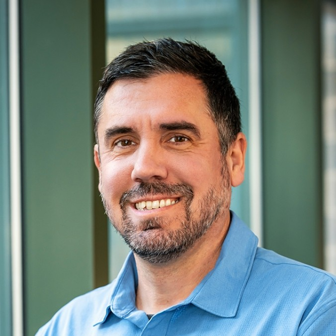

### John Wiedemann

*Supervisory Research Fishery Biologist*\
[john.wiedenmann@rutgers.edu](mailto:john.wiedenmann@rutgers.edu)

:::
::::

:::: {.card .h-75 .text-center .shadow-sm}
::: card-body

### Jeewantha Bandara

*PhD candidate*\
[jeewantha.bandara@rutgers.edu](mailto:jeewantha.bandara@rutgers.edu)

:::
::::
:::::::::::::::::

------------------------------------------------------------------------

## UMass Dartmouth (SMAST) {.background-heading}

::::::::::::::::: card-grid-4
:::: {.card .text-center .shadow-sm}
::: card-body
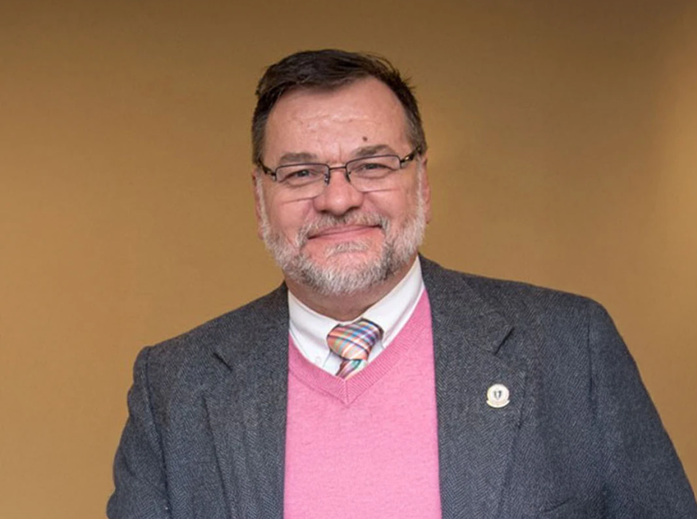

### Steve Cadrin

*Professor*\
[scadrin@umassd.edu](mailto:scadrin@umassd.edu)

:::
::::

:::: {.card .h-75 .text-center .shadow-sm}
::: card-body
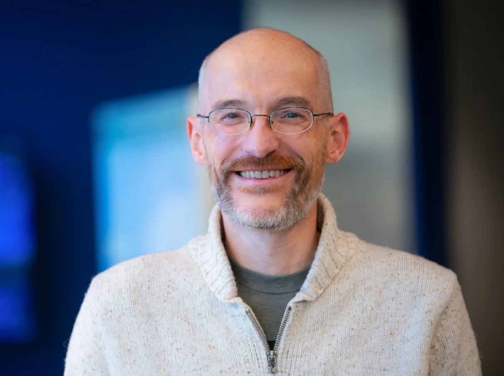

### Gavin Fay

*Associate Professor*\
[gfay@umassd.edu](mailto:gfay@umassd.edu)

:::
::::

:::: {.card .h-75 .text-center .shadow-sm}
::: card-body
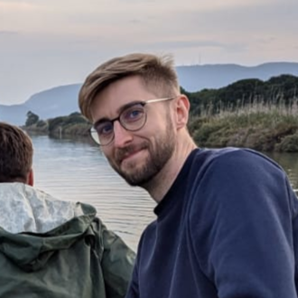

### Leander Hohne

*Research Associate*\
[lhohne@umassd.edu](mailto:lhohne@umassd.edu)

:::
::::

:::: {.card .h-75 .text-center .shadow-sm}
::: card-body
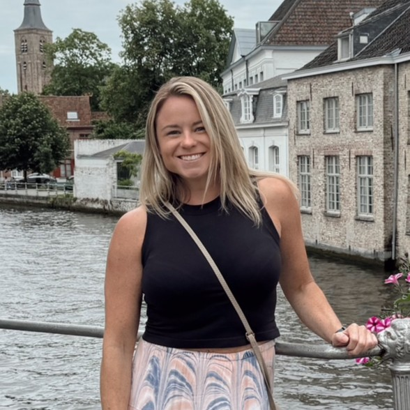

### Kelsey Roberts

*Research Associate*\
[kroberts6@umassd.edu](mailto:kroberts6@umassd.edu)

:::
::::

:::: {.card .h-75 .text-center .shadow-sm}
::: card-body
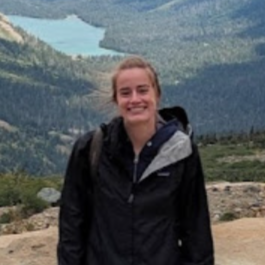

### Sophie Wulfing

*Research Associate*\
[swulfing@umassd.edu](mailto:swulfing@umassd.edu)
:::
::::
:::::::::::::::::

------------------------------------------------------------------------

## University of Delaware {.background-heading}

::::::::::::::::: card-grid-4
:::: {.card .text-center .shadow-sm}
::: card-body

### Anna Birkenbach

*Associate Professor*\
[abirken@udel.edu](mailto:abirken@udel.edu)

:::
::::
:::::::::::::::::

------------------------------------------------------------------------

## Past Contributors {.background-heading}

::::::::::::::::: card-grid-4
:::: {.card .text-center .shadow-sm}
::: card-body
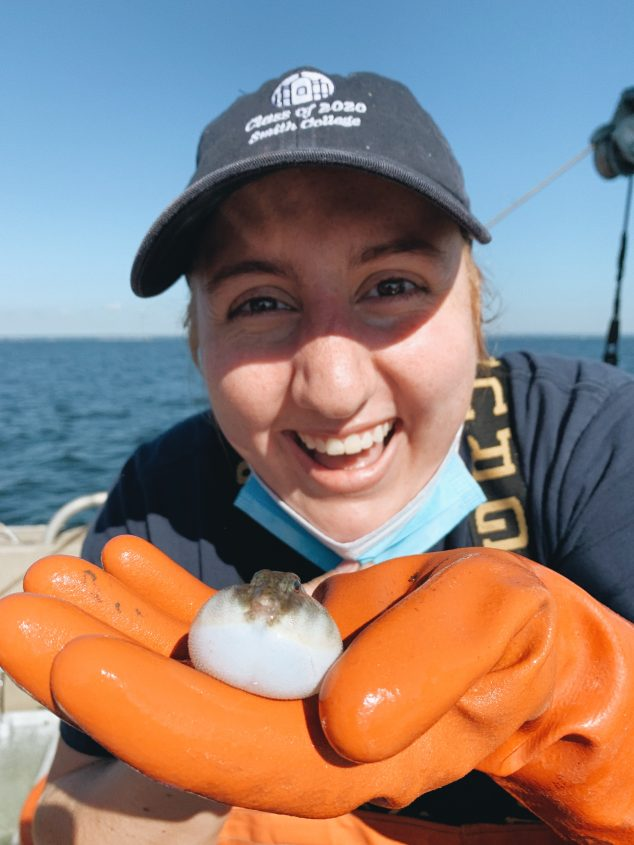

### Julia Luddy

:::
::::

:::: {.card .text-center .shadow-sm}
::: card-body
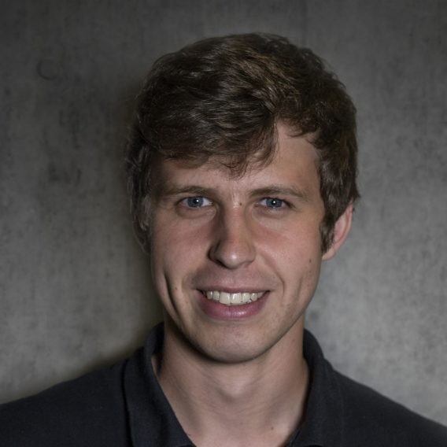

### Hubert du Pontavice
:::
::::

:::: {.card .h-75 .text-center .shadow-sm}
::: card-body
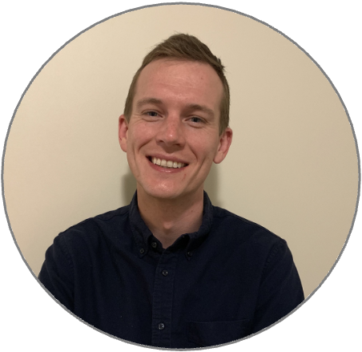

### Gregory Bopp
:::
::::

:::: {.card .h-75 .text-center .shadow-sm}
::: card-body
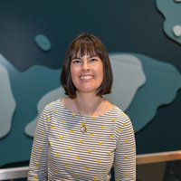

### Katherine Maltby
:::
::::

:::: {.card .h-75 .text-center .shadow-sm}
::: card-body
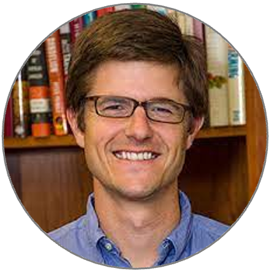

### Malin Pinsky
:::
::::

:::: {.card .h-75 .text-center .shadow-sm}
::: card-body
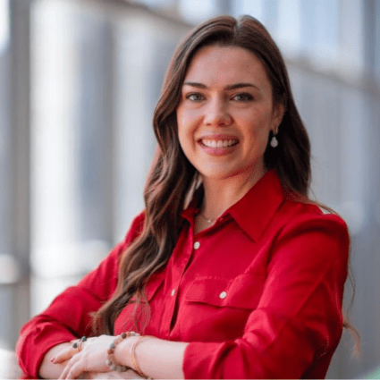

### Jessica Kittel
:::
::::

:::: {.card .h-75 .text-center .shadow-sm}
::: card-body
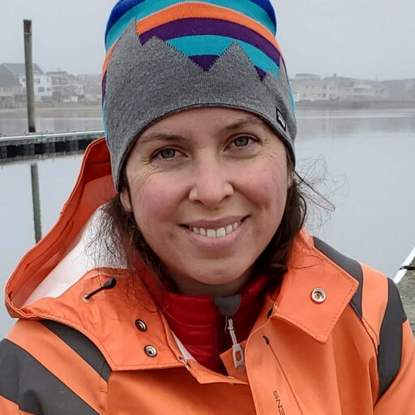

### Katrina Zarella Smith

:::
::::

:::: {.card .h-75 .text-center .shadow-sm}
::: card-body
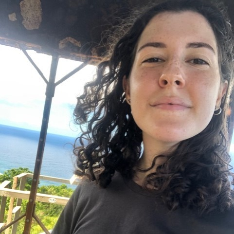

### Madeline Guyant

:::
::::

:::: {.card .h-75 .text-center .shadow-sm}
::: card-body
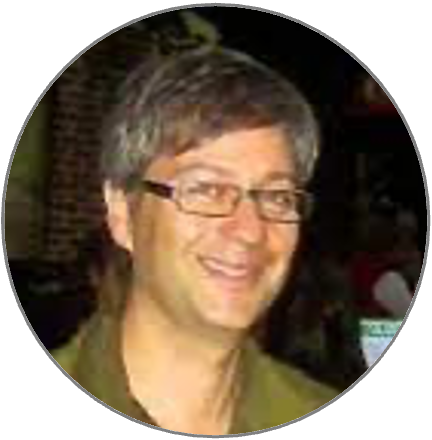

### Enrique Curchitser
:::
::::

:::: {.card .h-75 .text-center .shadow-sm}
::: card-body
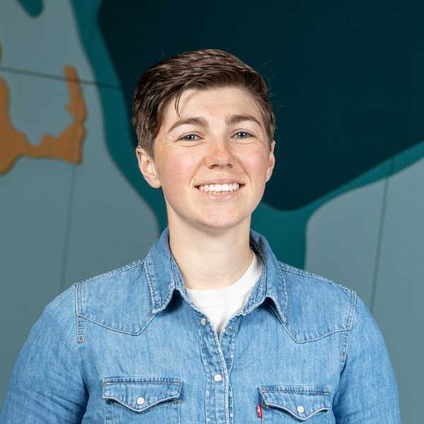

### Katie Lankowicz
:::
::::

:::: {.card .h-75 .text-center .shadow-sm}
::: card-body
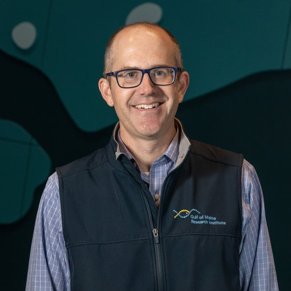

### Andy Pershing
:::
::::
:::::::::::::::::

------------------------------------------------------------------------