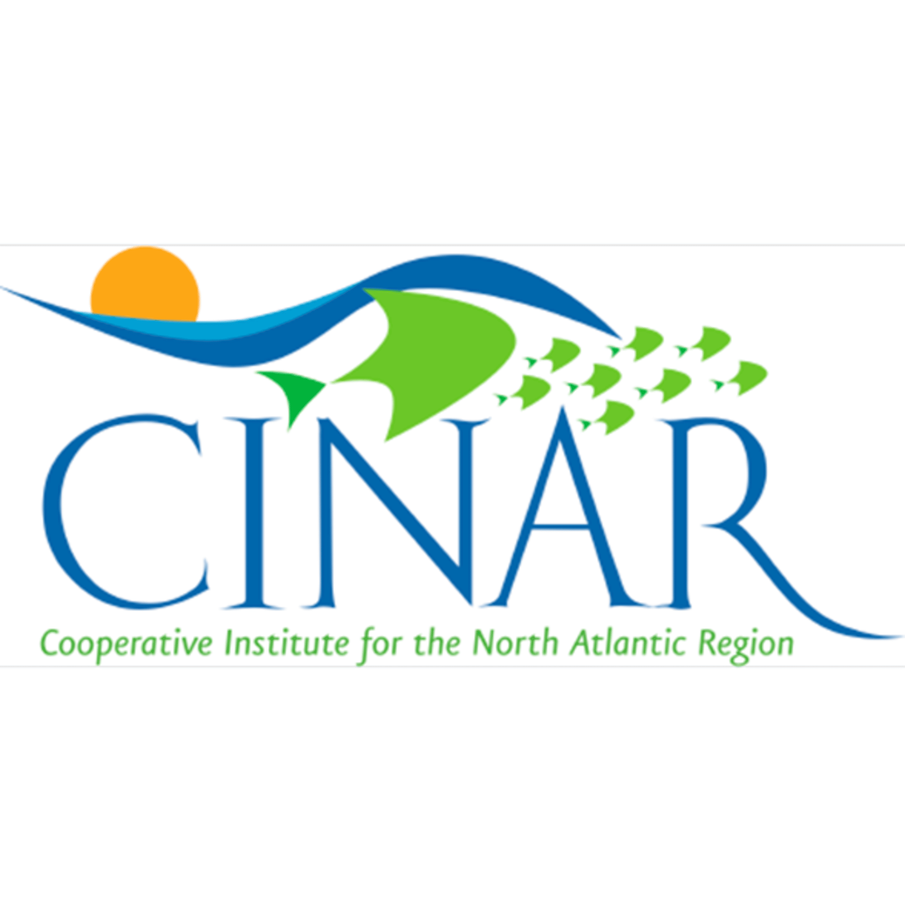
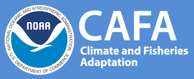
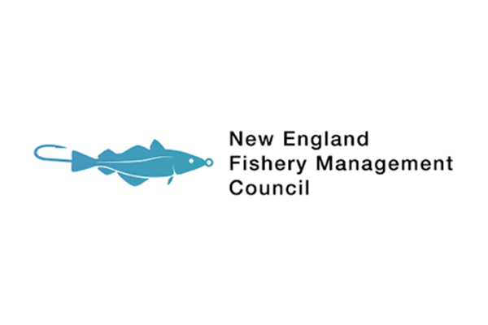
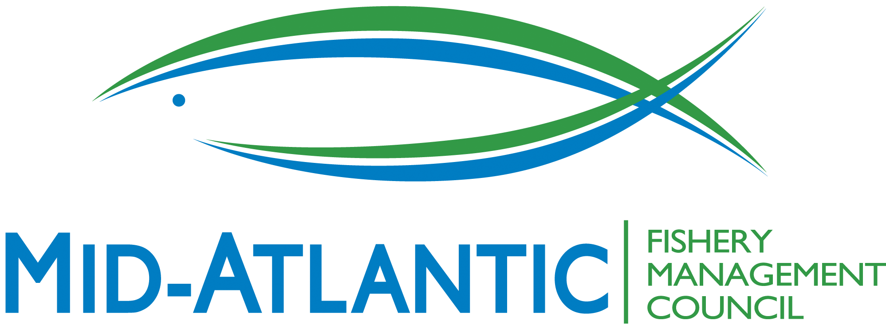
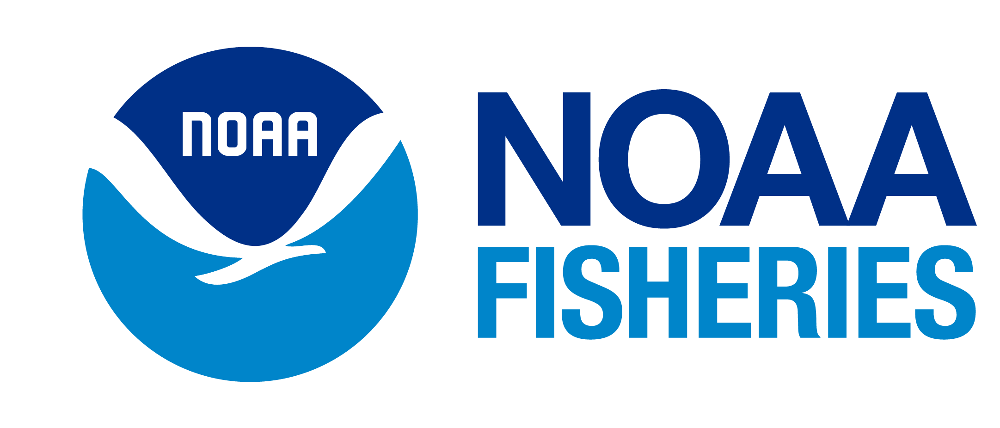

::: {.hero-banner}
# Northeast Climate Integrated Modeling Initiative (NCLIM)

Building multi-institutional, interdisciplinary partnerships and modeling capacity to advance adaptive fisheries management in a changing marine ecosystem.
:::

## Background {.background-heading}

::: {.background-callout}
Commercial and recreational fisheries are economic and cultural staples for many communities in the Northeast U.S., but changing environmental conditions call into question the long-term viability of these fisheries. Observed shifts in species distributions and productivity have already been linked to ocean warming and these impacts are expected to grow over time as waters in the Northwest Atlantic continue to warm at a rate four times the global average. There is an increasing need to understand how environmental shifts impact fisheries and develop adaptive strategies for fisheries to continue operating in the future.

Beyond biological and ecosystem impacts, a changing climate can directly impact the efficacy of existing fisheries management efforts. Stock assessments make data-informed assumptions about biological processes (e.g. growth, recruitment, and mortality) and harvesting characteristics (e.g. survey and fishery catchability) to evaluate stock status. Failure to identify and integrate climate impacts on stock and fishery dynamics into management procedures can result in biased estimates of stock status and ineffective harvest control rules. There is a need to identify when and how climate influences stock and fishery dynamics and to explore candidate management procedures that account for climate impacts more explicitly.
:::

::: {.FocusArea-callout}
## Our Focus Areas
:::

::::::::::::::::::::: grid
::::: {.g-col-12 .g-col-md-6}
:::: category-card
::: card-body
### 1. Fisheries Decision Making

Evaluating management strategies (MSE) to account for climate uncertainties and support stakeholder decision-making

[Explore this focus area →](FisheriesDecisionMaking.qmd){.btn-nclim}
:::
::::
:::::

::::: {.g-col-12 .g-col-md-6}
:::: category-card
::: card-body
### 2. Climate Adaptation

Identifying climate-informed management solutions and proactive frameworks for long-term sustainability

[Explore this focus area →](ClimateAdaptation.qmd){.btn-nclim}
:::
::::
:::::

::::: {.g-col-12 .g-col-md-6}
:::: category-card
::: card-body
### 3. Human Dimensions Modeling

Integrating socio-economic models to understand community impacts and resource dependencies under shifting conditions

[Explore this focus area →](HumanDimensionsModeling.qmd){.btn-nclim}
:::
::::
:::::

::::: {.g-col-12 .g-col-md-6}
:::: category-card
::: card-body
### 4. Stock Assessment

Developing candidate climate-informed stock assessment methods

[Explore this focus area →](StockAssessment.qmd){.btn-nclim}
:::
::::
:::::

::::: {.g-col-12 .g-col-md-6}
:::: category-card
::: card-body
### 5. Biological Reference Points

Updating and testing climate-enhanced biological reference points to improve assessment advice

[Explore this focus area →](BiologicalReferencePoints.qmd){.btn-nclim}
:::
::::
:::::

::::: {.g-col-12 .g-col-md-6}
:::: category-card
::: card-body
### 6. Ecosystem Modeling

Integrating global climate models, regional oceanography, and food web dynamics.

[Explore this focus area →](EcosystemModeling.qmd){.btn-nclim}
:::
::::
:::::
:::::::::::::::::::::

## Funders {.background-heading}

::: {.funders-grid}

[{.funder-card alt="CINAR"}](https://website.whoi.edu/cinar/){target="_blank"}

[{alt="Climate and Fisheries Adaptation (CAFA) Program"}]{.funder-card href="https://cpo.noaa.gov/divisions-programs/climate-and-societal-interactions/the-adaptation-sciences-program/climate-and-fisheries-adaptation-program/" target="_blank"}

[{alt="New England Fishery Management Council (NEFMC)"}]{.funder-card href="https://www.nefmc.org/" target="_blank"}

[{alt="Mid-Atlantic Fishery Management Council (MAFMC)"}]{.funder-card href="https://www.mafmc.org/" target="_blank"}

[{alt="NOAA Fisheries"}]{.funder-card href="https://www.fisheries.noaa.gov/" target="_blank"}

[{alt="Bycatch Reduction Engineering Program (BREP/BTRP)"}]{.funder-card href="https://www.fisheries.noaa.gov/national/bycatch/bycatch-reduction-engineering-program" target="_blank"}

:::