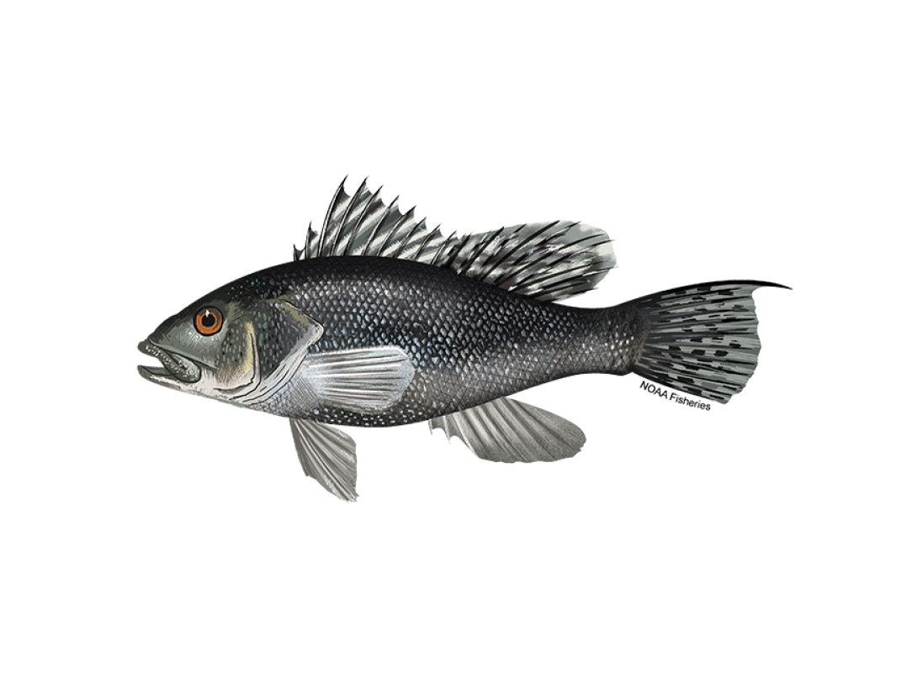

# Applications in Research Track Stock Assessments

:::::::::::::::::::: centered-div
:::::::: project-card
::: project-media

:::

:::::: publication-content
::: publication-title
American Plaice Research Track
:::

::: publication-authors
American plaice is a commercially important flatfish in the Northeast U.S. and Canada that is considered rebuilt. In recent years plaice have shifted further offshore and into deeper water, this shift is expected to continue with likely negative effects on the stock as ocean temperatures warm and suitable habitat contracts. Temperature has been shown to influence plaice distribution, depth, growth rate, recruitment, and possibly maturity, while other climate drivers (e.g. NAO, AMO) have been linked to changing recruits per spawner and distribution. Although population dynamics and distribution have clear links to climate dynamics, to date these influences have not been incorporated into stock assessments for plaice nor has this knowledge been used to provide estimates of climate uncertainties that may benefit decision-making processes. The NCLIM framework will be leveraged to integrate climate considerations into the research track stock assessment process for American plaice.
:::

::: project-link
[WHAM assessment model for American plaice (2021–2022 research track)](https://github.com/ahart1/PlaiceWG2021)

[Identifying environmental drivers of American plaice stock dynamics](https://github.com/Jamie-Behan/AM_Plaice_environmental_drivers)
:::
::::::
::::::::

:::::::: project-card
::: publication-media

:::

:::::: publication-content
::: publication-title
Atlantic Cod Research Track
:::

::: publication-authors
Atlantic cod (Gadus morhua) are a benthopelagic fish whose range in the northwestern Atlantic extends from Greenland to Cape Hatteras, North Carolina, with the majority of biomass in United States waters in the western Gulf of Maine (GOM) and Georges Bank (GBK) regions (Fahay, Michael P. and Northeast Fisheries Science Center (U.S.) 1999). Changes in ocean conditions have been documented to affect key life history processes, including recruitment, distribution, and growth of Atlantic cod. The historical productivity of cod fisheries has been high, but has experienced substantial population declines since the 1990s. Including ecosystem variables in stock assessments may lead to more precautionary advice (CAUSES 2019; Lynch et al 2018). To help achieve more sustainable fisheries management, these climate and ecosystem shifts should be closely tracked and considered. Therefore, it is important to explore the ways in which ecosystem and climate changes are affecting distributions, stock dynamics, and other life history characteristics of species such as cod in the GOM and GBK regions. Understanding how cod respond to ecological and climate drivers will likely help to reduce uncertainties related to estimates of stock size and composition. These benefits may help to better inform or improve management. The NCLIM framework will be leveraged to integrate climate considerations into the research track stock assessment process for Atlantic cod.
:::

::: project-link
[WHAM assessment model for Atlantic Cod (2022–2023 research track)](https://github.com/Northeast-Climate-Integrated-Modeling/Cod-Research-Track-Stock-Assessment)

[Identifying environmental drivers of Atlantic cod stock dynamics](https://github.com/Jamie-Behan/Atlantic_cod)
:::
::::::
::::::::

::::::: project-card
::: publication-media

:::

::::: publication-content
::: publication-title
[Multispecies population-scale emergence of climate change signals in an ocean warming hotspot](https://doi.org/10.1093/icesjms/fsad208)
:::

::: publication-authors
Black sea bass is a commercially and recreationally important species in the New England and Mid-Atlantic regions that has shown increased productivity in response to warming temperatures. The species has exhibited a northward shift in response to climate that is captured by divergent state surveys (increases in northern surveys and decreases in the south) but the coastwide survey suggests variability without trend. The single-area stock assessment proposed in 2012 struggled to replicate these divergent survey trends and the model ultimately did not pass review. Subsequent work found that two-area models exhibited improved fit to survey data, and there is interest in further exploring approaches to account for climate-driven species distribution shifts in stock assessments. The NCLIM framework will be leveraged to integrate climate considerations into the research track stock assessment process for black sea bass.
:::
:::::
:::::::
::::::::::::::::::::

# NCLIM Related Github Repositories

:::::::: {style="display: flex; justify-content: center; text-align: center; flex-wrap: wrap;"}
::: {style="margin: 10px;"}
[{height="200"}](https://github.com/Northeast-Climate-Integrated-Modeling/groundfish-MSE)\
[**Groundfish MSE Repository**](https://github.com/Northeast-Climate-Integrated-Modeling/groundfish-MSE)
:::

::: {style="margin: 10px;"}
[{height="200"}](https://github.com/NOAA-GFDL/MOM6-examples)\
[**MOM6 Examples Repository**](https://github.com/NOAA-GFDL/MOM6-examples)
:::

::: {style="margin: 10px;"}
[{height="200"}](https://github.com/timjmiller/SSRTWG)\
[**State-space Research Track Working Group**](https://github.com/timjmiller/SSRTWG)
:::

::: {style="margin: 10px;"}
[{height="200"}](https://github.com/Jamie-Behan/Indicator_Visualizations)\
[**Indicator Visualizations Repository**](https://github.com/Jamie-Behan/Indicator_Visualizations)
:::

::: {style="margin: 10px;"}
[{height="200"}](https://timjmiller.github.io/wham/)\
[**WHAM Repository**](https://timjmiller.github.io/wham/)
:::
::::::::
