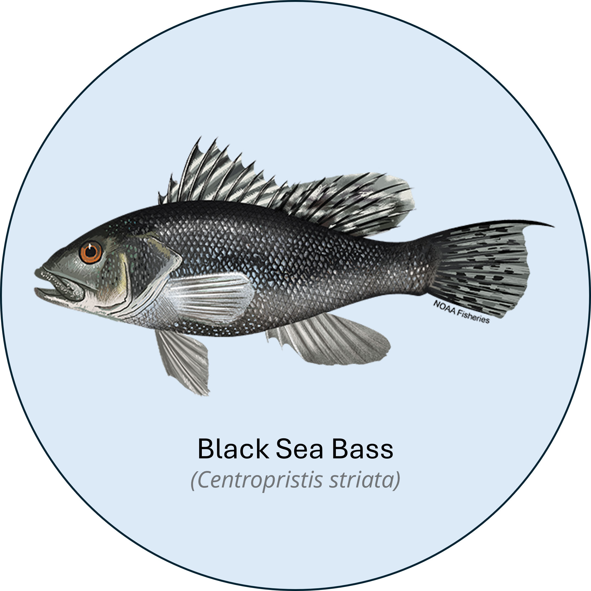
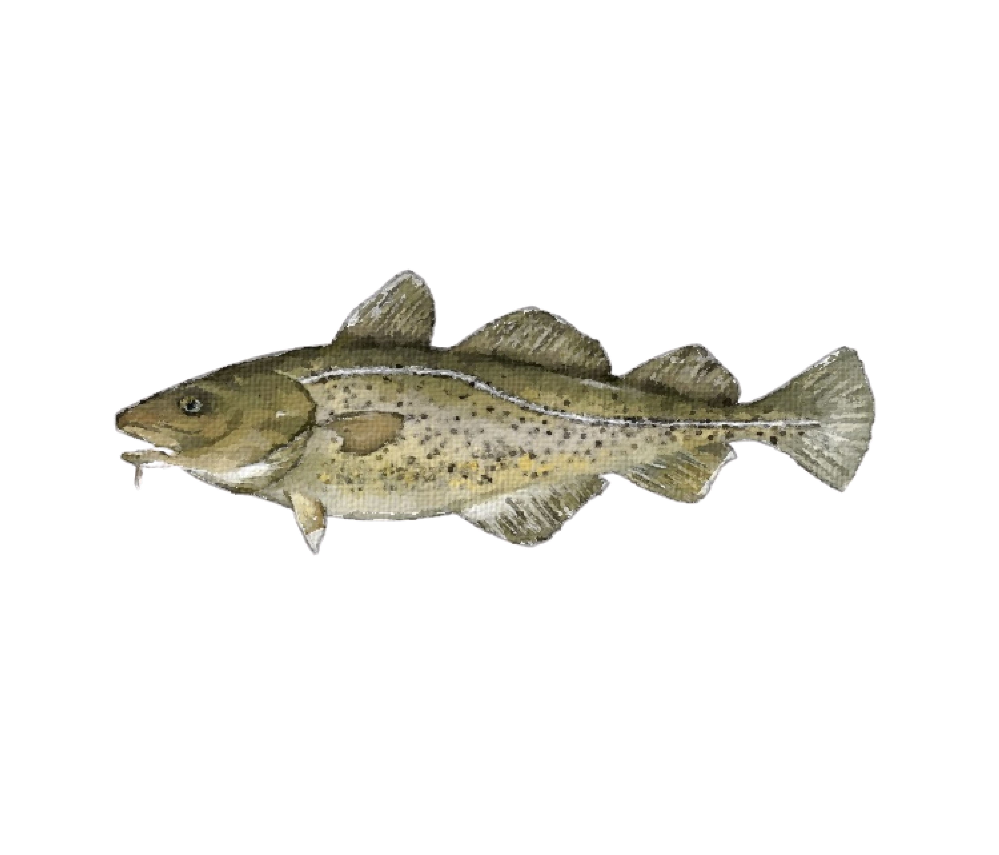
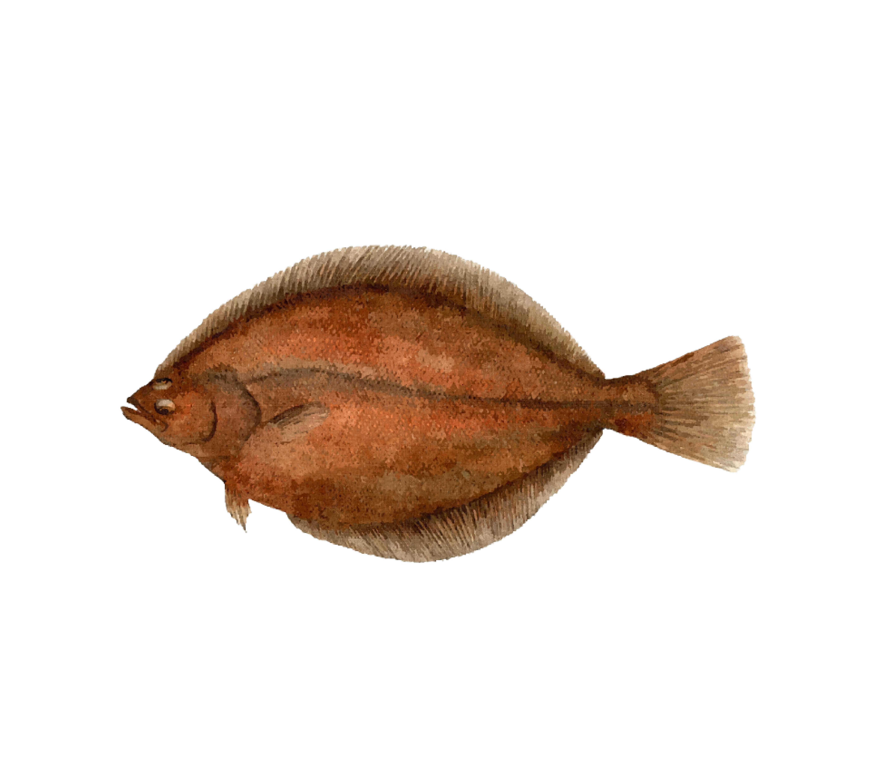
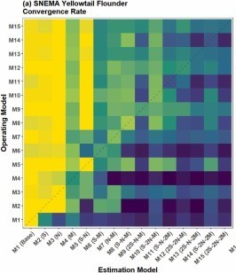
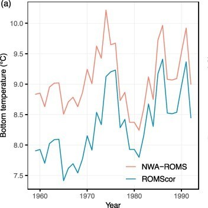
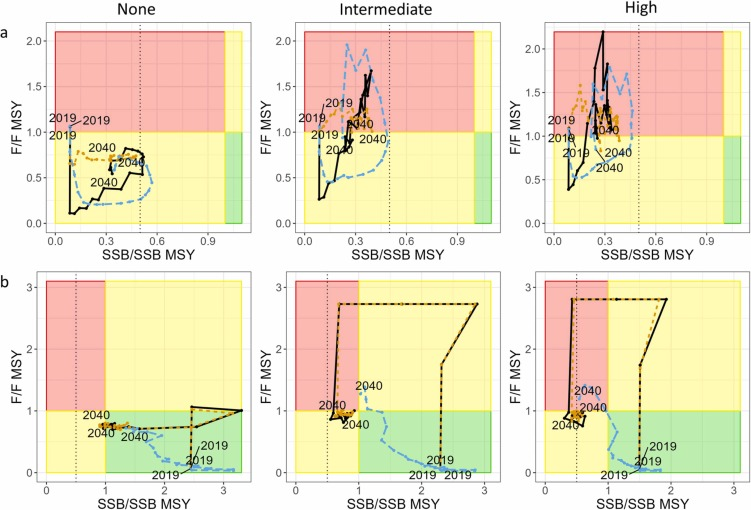
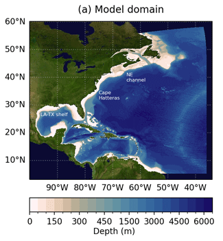
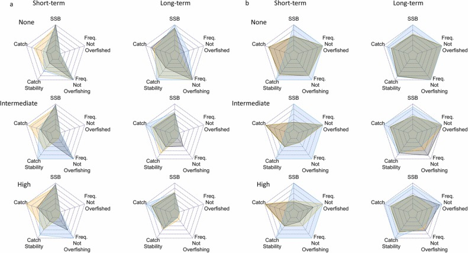
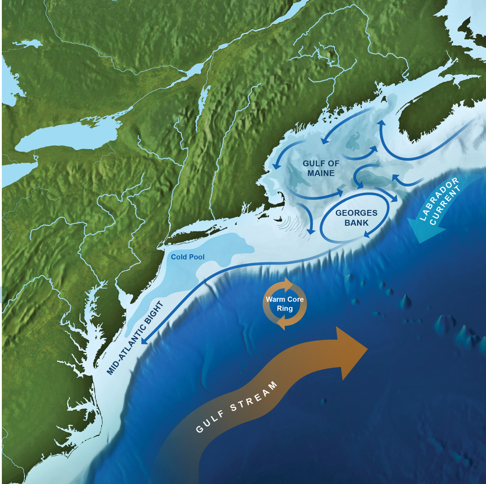

# Applications in research track stock assessments

Click on a photo to go to the research track page for that species

::: {style="margin-right: 10px;"}
[{height="200"}](BlackSeaBassRT.qmd)
:::

[{height="200"}](AtlanticCodRT.qmd)

::::::

# NCLIM Related Github Repositories

:::::::: {style="display: flex; justify-content: center; text-align: center; flex-wrap: wrap;"}
::: {style="margin: 10px;"}
[{height="200"}](https://github.com/Northeast-Climate-Integrated-Modeling/groundfish-MSE)\
[**Groundfish MSE Repository**](https://github.com/Northeast-Climate-Integrated-Modeling/groundfish-MSE)
:::

::: {style="margin: 10px;"}
[{height="200"}](https://github.com/NOAA-GFDL/MOM6-examples)\
[**MOM6 Examples Repository**](https://github.com/NOAA-GFDL/MOM6-examples)
:::

::: {style="margin: 10px;"}
[{height="200"}](https://github.com/timjmiller/SSRTWG)\
[**State-space Research Track Working Group**](https://github.com/timjmiller/SSRTWG)
:::

::: {style="margin: 10px;"}
[{height="200"}](https://github.com/Jamie-Behan/Indicator_Visualizations)\
[**Indicator Visualizations Repository**](https://github.com/Jamie-Behan/Indicator_Visualizations)
:::

::: {style="margin: 10px;"}
[{height="200"}](https://timjmiller.github.io/wham/)\
[**WHAM Repository**](https://timjmiller.github.io/wham/)
:::
::::::::

::::::::::::::::::::::::::::::::::::::::::::::::::::::::: centered-div
:::::::: project-card
::: publication-media

:::

:::::: publication-content
::: publication-title
American Plaice Research Track
:::

::: project-link
[WHAM assessment model for American plaice (2021–2022 research track)](https://github.com/ahart1/PlaiceWG2021)

[Identifying environmental drivers of American plaice stock dynamics](https://github.com/Jamie-Behan/AM_Plaice_environmental_drivers)
:::

::: publication-authors
American plaice is a commercially important flatfish in the Northeast U.S. and Canada that is considered rebuilt. In recent years plaice have shifted further offshore and into deeper water, this shift is expected to continue with likely negative effects on the stock as ocean temperatures warm and suitable habitat contracts. Temperature has been shown to influence plaice distribution, depth, growth rate, recruitment, and possibly maturity, while other climate drivers (e.g. NAO, AMO) have been linked to changing recruits per spawner and distribution. Although population dynamics and distribution have clear links to climate dynamics, to date these influences have not been incorporated into stock assessments for plaice nor has this knowledge been used to provide estimates of climate uncertainties that may benefit decision-making processes. The NCLIM framework will be leveraged to integrate climate considerations into the research track stock assessment process for American plaice.
:::
::::::
::::::::

:::::::: project-card
::: publication-media

:::

:::::: publication-content
::: publication-title
[Impacts of changing ocean conditions on American plaice (Hippoglossoides platessoides) stock dynamics](https://doi.org/10.1007/s10641-026-01867-z)
:::

::: project-link
2026
:::

::: publication-authors
Behan JT, Kerr LA
:::
::::::
::::::::

:::::::: publication-card
::: publication-media

:::

:::::: publication-content
::: publication-title
[Multispecies population-scale emergence of climate change signals in an ocean warming hotspot](https://doi.org/10.1093/icesjms/fsad208)
:::

::: publication-year
2024
:::

::: publication-authors
Mills KE, Kemberling A, Kerr LA, Lucey SM, McBride RS, Nye JA, Pershing AJ, Barajas M, Lovas CS
:::
::::::
::::::::

:::::::: publication-card
::: publication-media

:::

:::::: publication-content
::: publication-title
[An evaluation of common stock assessment diagnostic tools for choosing among state-space models](https://doi.org/10.1016/j.fishres.2024.106968)
:::

::: publication-year
2024
:::

::: publication-authors
Li C, Deroba JJ, Miller TJ, Legault CM, Perretti CT
:::
::::::
::::::::

:::::::: publication-card
::: publication-media

:::

:::::: publication-content
::: publication-title
[A high-resolution bottom temperature product for the northeast U.S. continental shelf marine ecosystem](https://doi.org/10.1016/j.pocean.2022.102948)
:::

::: publication-year
2023
:::

::: publication-authors
du Pontavice H, Chen Z, Saba, VS
:::
::::::
::::::::

:::::::: publication-card
::: publication-media

:::

:::::: publication-content
::: publication-title
[Consequences of ignoring climate impacts on New England groundfish stock assessment and management](https://doi.org/10.1016/j.fishres.2023.106652)
:::

::: publication-year
2023
:::

::: publication-authors
Mazur MD, Jesse J, Cadrin SX, Truesdell SB, Kerr L
:::
::::::
::::::::

:::::::: publication-card
::: publication-media

:::

:::::: publication-content
::: publication-title
[A high-resolution physical–biogeochemical model for marine resource applications in the northwest Atlantic (MOM6-COBALT-NWA12 v1.0)](https://doi.org/10.5194/gmd-16-6943-2023)
:::

::: publication-year
2023
:::

::: publication-authors
Ross AC, Stock CA, Adcroft A, Curchitser E, Hallberg R, Harrison MJ, Hedstrom K, et al.
:::
::::::
::::::::

:::::::: publication-card
::: publication-media

:::

:::::: publication-content
::: publication-title
[Estimating population trends with stratified random sampling under the pressures of climate change](https://doi.org/10.1016/j.fishres.2023.106652)
:::

::: publication-year
2023
:::

::: publication-authors
Mazur MD, Jesse J, Cadrin SX, Truesdell SB, Kerr L
:::
::::::
::::::::

:::::::: publication-card
::: publication-media

:::

:::::: publication-content
::: publication-title
[NOAA Fisheries research geared towards climate-ready living marine resource management in the northeast United States](https://doi.org/10.1371/journal.pclm.0000323)
:::

::: publication-year
2023
:::

::: publication-authors
Saba V, Borggaard D, Caracappa JC, Chambers RC, Clay PM, Colburn LL, et al.
:::
::::::
::::::::
:::::::::::::::::::::::::::::::::::::::::::::::::::::::::
