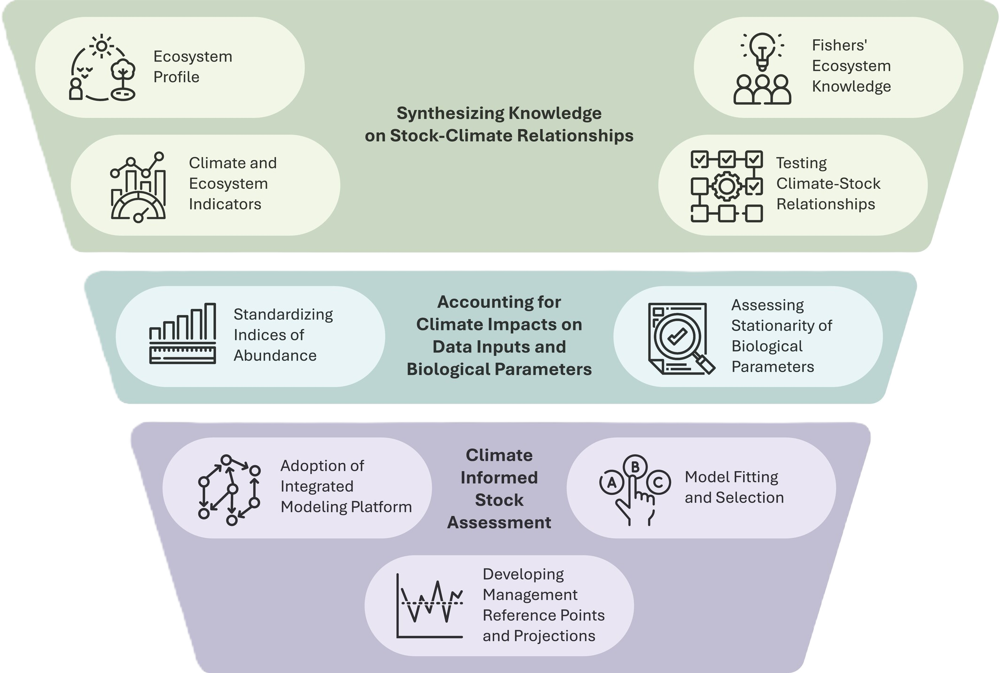
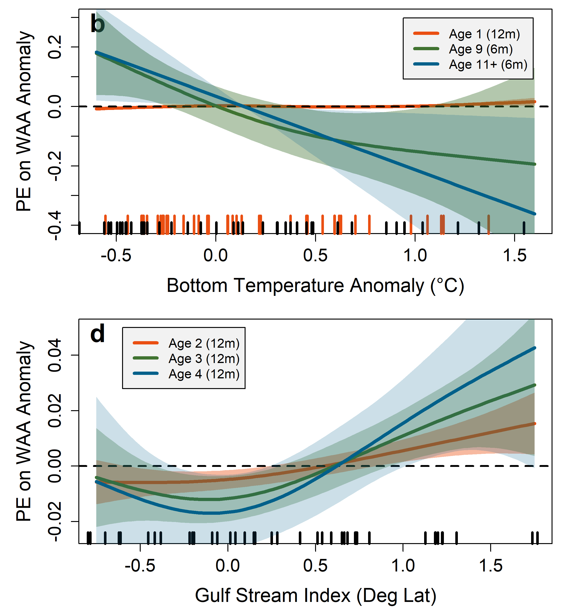
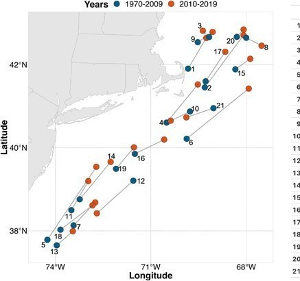

::::::::::::::::::::::::::::::::::::::::::::::: centered-div
::::::::: publication-card
::: publication-media
 
:::

::::::: publication-content
::: publication-title
[Climate Attribution in Fishery Stock Assessment: Case Studies From the Northeast U.S. Groundfish Stocks](https://doi.org/10.1111/faf.70102)
:::

::: publication-year
2026
:::

::: publication-authors
Kerr LA, Behan JT, Cadrin SX, Hansell AC, Hart AR, Kittel JA, Large SI, Miller, TJ, Tyrell AS
:::

:::::::
:::::::::

::::::::: publication-card
::: publication-media
 
:::

::::::: publication-content
::: publication-title
[Impacts of changing ocean conditions on American plaice (Hippoglossoides platessoides) stock dynamics](https://doi.org/10.1007/s10641-026-01867-z)
:::

::: publication-year
2026
:::

::: publication-authors
Behan JT, Kerr LA
:::

:::::::
:::::::::

::::::::: publication-card
::: publication-media
 
:::

::::::: publication-content
::: publication-title
[Multispecies population-scale emergence of climate change signals in an ocean warming hotspot](https://doi.org/10.1093/icesjms/fsad208)
:::

::: publication-year
2024
:::

::: publication-authors
Mills KE, Kemberling A, Kerr LA, Lucey SM, McBride RS, Nye JA, Pershing AJ, Barajas M, Lovas CS
:::

:::::::
:::::::::

::::::::: publication-card
::: publication-media
 
:::

::::::: publication-content
::: publication-title
[An evaluation of common stock assessment diagnostic tools for choosing among state-space models](https://doi.org/10.1016/j.fishres.2024.106968)
:::

::: publication-year
2024
:::

::: publication-authors
Li C, Deroba JJ, Miller TJ, Legault CM, Perretti CT
:::

:::::::
:::::::::

::::::::: publication-card
::: publication-media
 
:::

::::::: publication-content
::: publication-title
[A high-resolution bottom temperature product for the northeast U.S. continental shelf marine ecosystem](https://doi.org/10.1016/j.pocean.2022.102948)
:::

::: publication-year
2023
:::

::: publication-authors
du Pontavice H, Chen Z, Saba, VS
:::

:::::::
:::::::::

::::::::: publication-card
::: publication-media
 
:::

::::::: publication-content
::: publication-title
[Consequences of ignoring climate impacts on New England groundfish stock assessment and management](https://doi.org/10.1016/j.fishres.2023.106652)
:::

::: publication-year
2023
:::

::: publication-authors
Mazur MD, Jesse J, Cadrin SX, Truesdell SB, Kerr L
:::

:::::::
:::::::::

::::::::: publication-card
::: publication-media
 
:::

::::::: publication-content
::: publication-title
[A high-resolution physical–biogeochemical model for marine resource applications in the northwest Atlantic (MOM6-COBALT-NWA12 v1.0)](https://doi.org/10.5194/gmd-16-6943-2023)
:::

::: publication-year
2023
:::

::: publication-authors
Ross AC, Stock CA, Adcroft A, Curchitser E, Hallberg R, Harrison MJ, Hedstrom K, et al.
:::

:::::::
:::::::::

::::::::: publication-card
::: publication-media
 
:::

::::::: publication-content
::: publication-title
[Estimating population trends with stratified random sampling under the pressures of climate change](https://doi.org/10.1016/j.fishres.2023.106652)
:::

::: publication-year
2023
:::

::: publication-authors
Mazur MD, Jesse J, Cadrin SX, Truesdell SB, Kerr L
:::

:::::::
:::::::::

::::::::: publication-card
::: publication-media
 
:::

::::::: publication-content
::: publication-title
[NOAA Fisheries research geared towards climate-ready living marine resource management in the northeast United States](https://doi.org/10.1371/journal.pclm.0000323)
:::

::: publication-year
2023
:::

::: publication-authors
 Saba V, Borggaard D, Caracappa JC, Chambers RC, Clay PM, Colburn LL, et al.
:::

:::::::
:::::::::