::::::::::::::::::::::::::::::::::::::::::::::::::::::::::::::::::: centered-div
::::::::: publication-card
::: publication-media
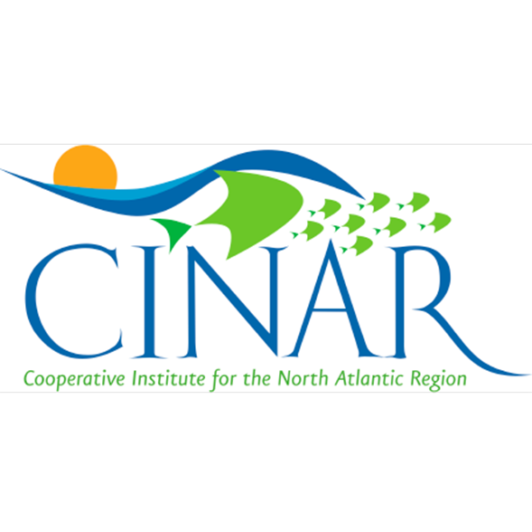
:::

::::::: publication-content
::: publication-title
[Defining Biological Reference Points in a Dynamic Northeast U.S. Marine Environment. CINAR Workshop Report](https://d23h0vhsm26o6d.cloudfront.net/CINAR_BRP_Workshop_Final_Report.pdf)
:::

::: publication-year
2024
:::

::: publication-authors
Kerr, L.A., Jesse, J., Cadrin, S.X., editors 
:::
:::::::
:::::::::

::::::::: publication-card
::: publication-media
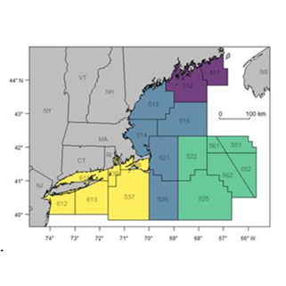
:::

::::::: publication-content
::: publication-title
[Comparing Candidate Spatial Management Unit Structures for U.S. Atlantic Cod: Preliminary Demonstrations. Technical Report to the NEFMC](https://d23h0vhsm26o6d.cloudfront.net/3_REVISED_CodStockStructureMSE_TechReport_March2024_SSCreview.pdf)
:::

::: publication-year
2024
:::

::: publication-authors
Brothers JR, Kerr L, Jesse J, Cadrin SX, Chen Y, Perretti C
:::
:::::::
:::::::::

::::::::: publication-card
::: publication-media

:::

::::::: publication-content
::: publication-title
[Prototype Management Strategy Evaluation for Georges Bank Ecosystem-Based Fisheries Management](https://d23h0vhsm26o6d.cloudfront.net/4a_Draft-final-simulation-results-report_2023-07-06-181455_iahe.pdf)
:::

::: publication-year
2023
:::

::: publication-authors
Fay G, Kerr L, Guyant M, Jesse J, Liljestrand E
:::
:::::::
:::::::::

::::::::: publication-card
::: publication-media
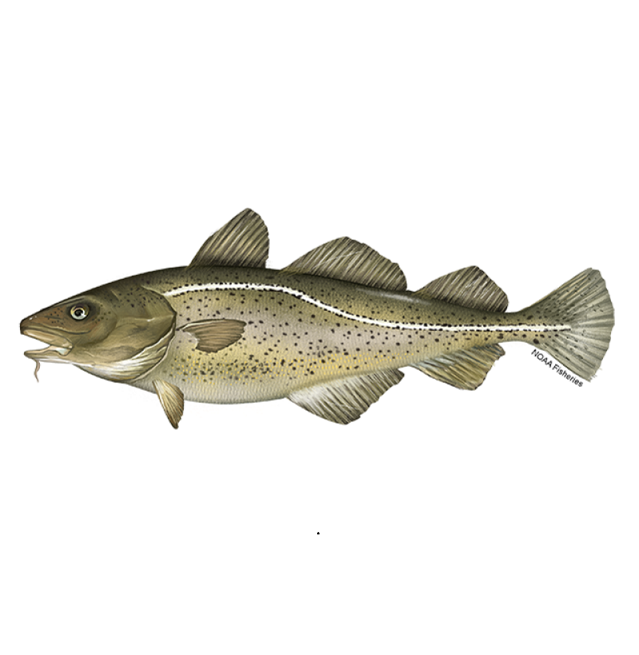
:::

::::::: publication-content
::: publication-title
[Atlantic Cod Research Track Stock Assessment Report](https://apps-nefsc.fisheries.noaa.gov/saw/sasi_files.php?year=2023&species_id=4&stock_id=11&review_type_id=5&info_type_id=-1&map_type_id=&filename=Atlantic%20cod%20WG%20FULL%20REPORT%20format%20w.%20exec%20summ%20(1).pdf)
:::

::: publication-year
2023
:::

::: publication-authors
Atlantic Cod Research Track Working Group: Kerr L, Andruschenko I, Cadrin C, Cooper-MacDonald K, Cournane J, Dean M, Hansell A, Large S, McBride R, Perretti C, Sosebee K, et al.
:::
:::::::
:::::::::

::::::::: publication-card
::: publication-media
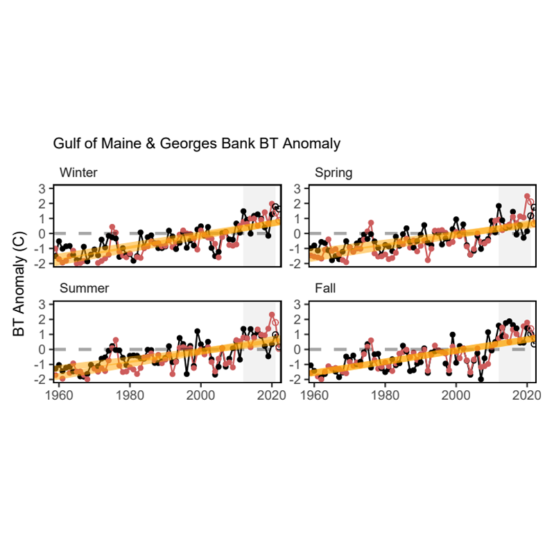
:::

::::::: publication-content
::: publication-title
[TOR1: Ecosystem and Climate Influences Report Chapter for the Atlantic Cod Research Track](https://apps-nefsc.fisheries.noaa.gov/saw/sasi_files.php?year=2023&species_id=4&stock_id=11&review_type_id=5&info_type_id=5&map_type_id=&filename=ToR%201%20Report%20Chapter.pdf)
:::

::: publication-year
2023
:::

::: publication-authors
Behan J, Tyrell A, Hart A, Large S, Hansell A, Lankowicz K, Morse R, Andruschenko I, Gross J, Kerr L
:::
:::::::
:::::::::

::::::::: publication-card
::: publication-media
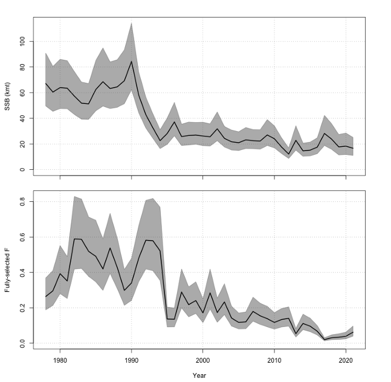
:::

::::::: publication-content
::: publication-title
[TOR4: Estimate Stock size and Fishing Mortality. Chapter 4. Atlantic Cod Research Track Stock Assessment](https://apps-nefsc.fisheries.noaa.gov/saw/sasi_files.php?year=2023&species_id=4&stock_id=11&review_type_id=5&info_type_id=5&map_type_id=&filename=ToR%204%20Report%20Chapter.pdf)
:::

::: publication-year
2023
:::

::: publication-authors
Perretti C, Hart A, Hansell A, Cadrin S, Dean M, Carrano C, Kerr L
:::
:::::::
:::::::::

::::::::: publication-card
::: publication-media
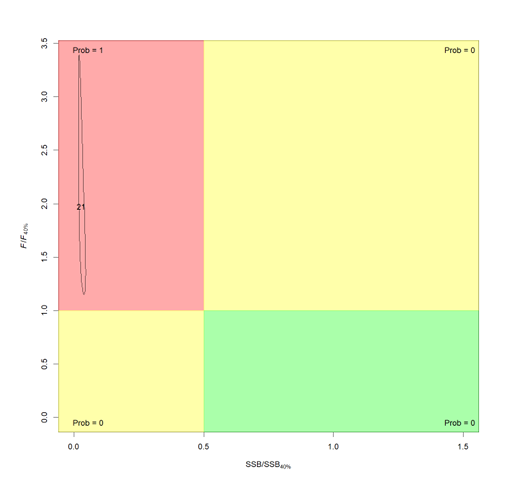
:::

::::::: publication-content
::: publication-title
[TOR5: Status Determination Criteria. Chapter 5. Atlantic Cod Research Track Stock Assessment](https://apps-nefsc.fisheries.noaa.gov/saw/sasi_files.php?year=2023&species_id=4&stock_id=11&review_type_id=5&info_type_id=5&map_type_id=&filename=ToR%205%20Report%20Chapter.pdf)
:::

::: publication-year
2023
:::

::: publication-authors
Perretti C, Cadrin S, Hart A, Dean M, Hansell A, Kerr L
:::
:::::::
:::::::::

::::::::: publication-card
::: publication-media
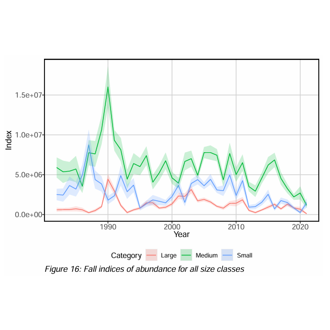
:::

::::::: publication-content
::: publication-title
[Integrated Survey Indices (VAST). Working Paper 10. Atlantic Cod Research Track Stock Assessment](https://apps-nefsc.fisheries.noaa.gov/saw/sasi_files.php?year=2023&species_id=4&stock_id=11&review_type_id=5&info_type_id=5&map_type_id=&filename=WP%2010%20Integrated%20Survey%20Indices%20(VAST).pdf)
:::

::: publication-year
2023
:::

::: publication-authors
Lankowicz K
:::
:::::::
:::::::::

::::::::: publication-card
::: publication-media
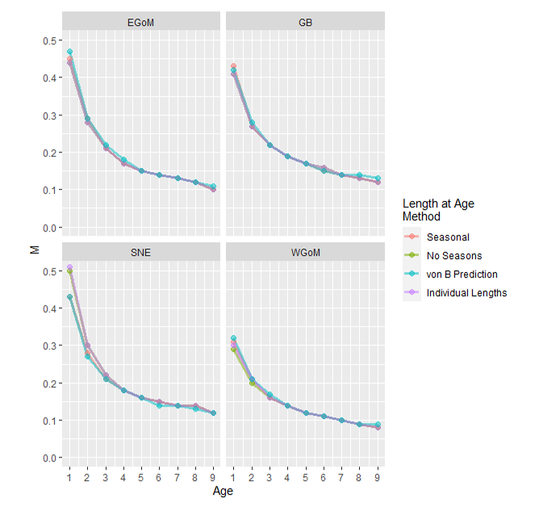
:::

::::::: publication-content
::: publication-title
[Approximation of Natural Mortality Rate of Cod in Four Proposed Stock Areas Using Life History Traits. Working Paper 14. Atlantic Cod Research Track Stock Assessment](https://apps-nefsc.fisheries.noaa.gov/saw/sasi_files.php?year=2023&species_id=4&stock_id=11&review_type_id=5&info_type_id=5&map_type_id=&filename=WP%2014%20Estimating%20Cod%20M%20by%20Stock.pdf)
:::

::: publication-year
2023
:::

::: publication-authors
Brothers JR, Kerr L, Cadrin S, Tyrell A
:::
:::::::
:::::::::

::::::::: publication-card
::: publication-media
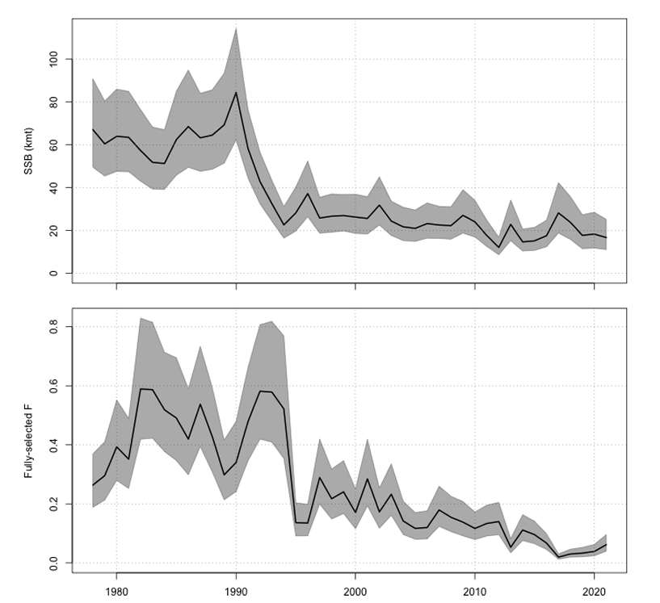
:::

::::::: publication-content
::: publication-title
[Assessment Model Development for the Georges Bank Atlantic Cod Stock. Working Paper 19. Atlantic Cod Research Track Stock Assessment](https://apps-nefsc.fisheries.noaa.gov/saw/sasi_files.php?year=2023&species_id=4&stock_id=11&review_type_id=5&info_type_id=5&map_type_id=&filename=WP%2019%20GB%20Assessmnet%20Model%20ToR%204.pdf)
:::

::: publication-year
2023
:::

::: publication-authors
Hart A, Kerr L
:::
:::::::
:::::::::

::::::::: publication-card
::: publication-media
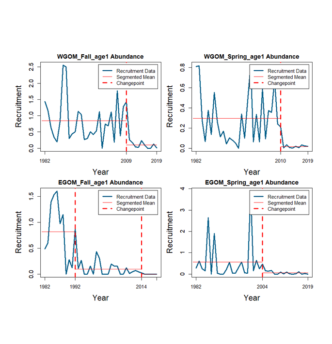
:::

::::::: publication-content
::: publication-title
[Defining Projections and Biological Reference points for Atlantic Cod in a Changing Ecosystem. Working paper 20 prepared for ToR 5 in the Atlantic Cod Research Track Stock Assessment](https://apps-nefsc.fisheries.noaa.gov/saw/sasi_files.php?year=2023&species_id=4&stock_id=11&review_type_id=5&info_type_id=5&map_type_id=&filename=WP%2020%20Reference%20Points.pdf)
:::

::: publication-year
2023
:::

::: publication-authors
Kerr L, Behan J
:::
:::::::
:::::::::

::::::::: publication-card
::: publication-media
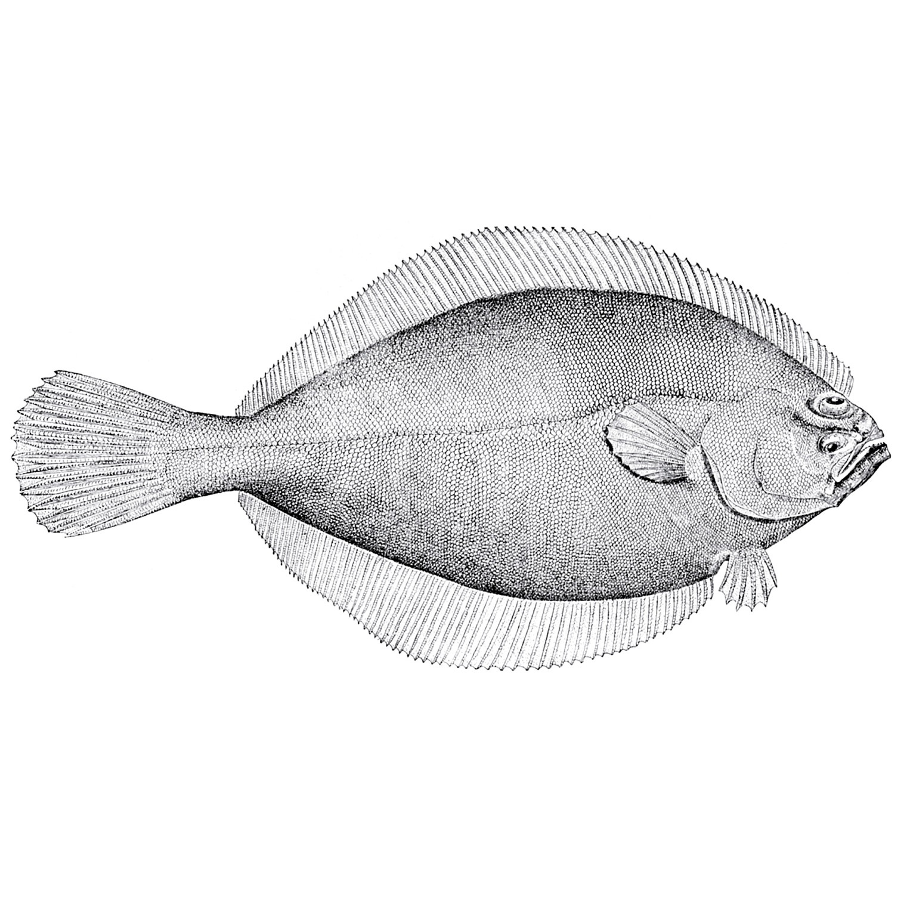
:::

::::::: publication-content
::: publication-title
[Report of the American Plaice Research Track Working Group](https://apps-nefsc.fisheries.noaa.gov/saw/sasi_files.php?year=2022&species_id=2&stock_id=4&review_type_id=5&info_type_id=5&map_type_id=&filename=American%20Plaice%20WG%20Report.pdf)
:::

::: publication-year
2022
:::

::: publication-authors
Alade L, Cadrin S, Cournane J, Hansell A, Hennen D, Kerr L, Kumar R, Palvlowich T, Richardson D, et al.
:::
:::::::
:::::::::

::::::::: publication-card
::: publication-media
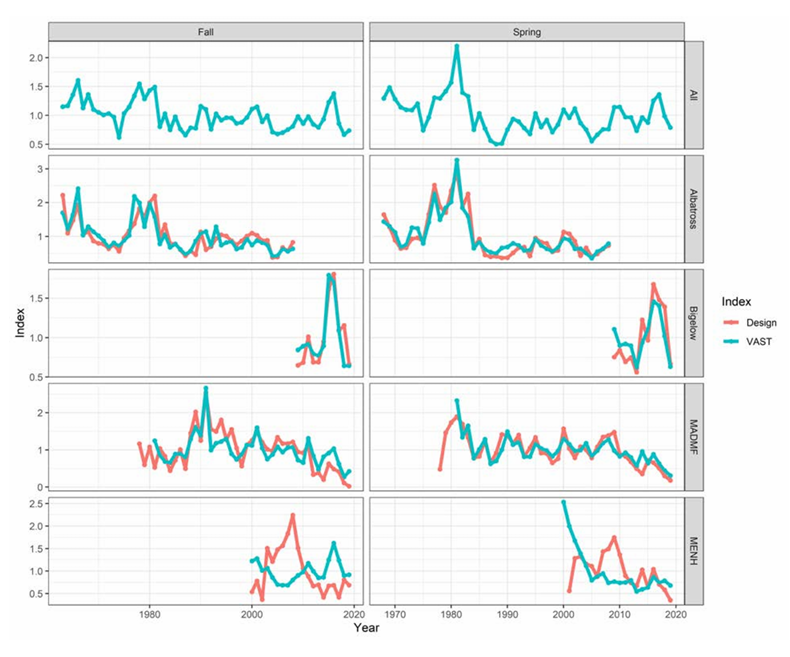
:::

::::::: publication-content
::: publication-title
[Spatio-temporal dynamics of American plaice (Hippoglossoides platessoides) in US waters of the northwest Atlantic, Working Paper 12, American Plaice Research Track Stock Assessment](https://apps-nefsc.fisheries.noaa.gov/saw/sasi_files.php?year=2022&species_id=2&stock_id=4&review_type_id=5&info_type_id=5&map_type_id=&filename=WP12_Plaice_VAST-v2.pdf)
:::

::: publication-year
2022
:::

::: publication-authors
Hansell A, Alade L, Allyn A, Brewster L, Cadrin S, Kerr L, et al.
:::
:::::::
:::::::::

::::::::: publication-card
::: publication-media
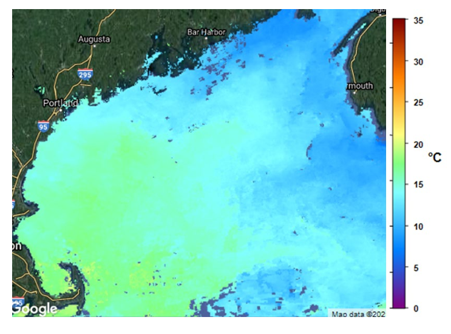
:::

::::::: publication-content
::: publication-title
[Ecosystem profile of American plaice. Working Paper 14. American Plaice Research Track Stock Assessment](https://apps-nefsc.fisheries.noaa.gov/saw/sasi_files.php?year=2022&species_id=2&stock_id=4&review_type_id=5&info_type_id=5&map_type_id=&filename=WP14%20Behan%20etal%20Ecosystem%20Profile.pdf)
:::

::: publication-year
2022
:::

::: publication-authors
Behan J, Kerr L, Hart H, Hansell A, Paklovitch T, Cadrin S
:::
:::::::
:::::::::

::::::::: publication-card
::: publication-media
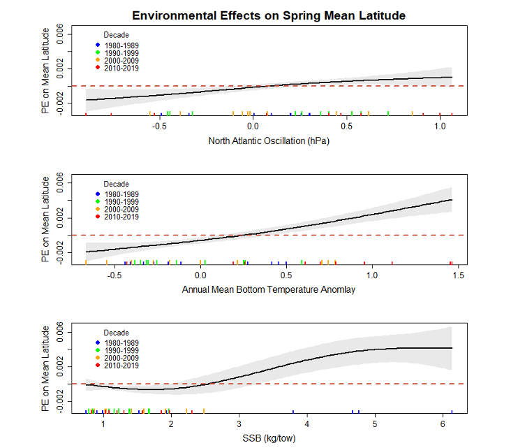
:::

::::::: publication-content
::: publication-title
[Environmental Influences on American Plaice Stock Dynamics. Working paper 16. American Plaice Research Track Stock Assessment](https://apps-nefsc.fisheries.noaa.gov/saw/sasi_files.php?year=2022&species_id=2&stock_id=4&review_type_id=5&info_type_id=5&map_type_id=&filename=WP16%20Behan%20_%20Kerr%20Ecosystem%20Drivers.pdf)
:::

::: publication-year
2022
:::

::: publication-authors
Behan J, Kerr L
:::
:::::::
:::::::::

::::::::: publication-card
::: publication-media
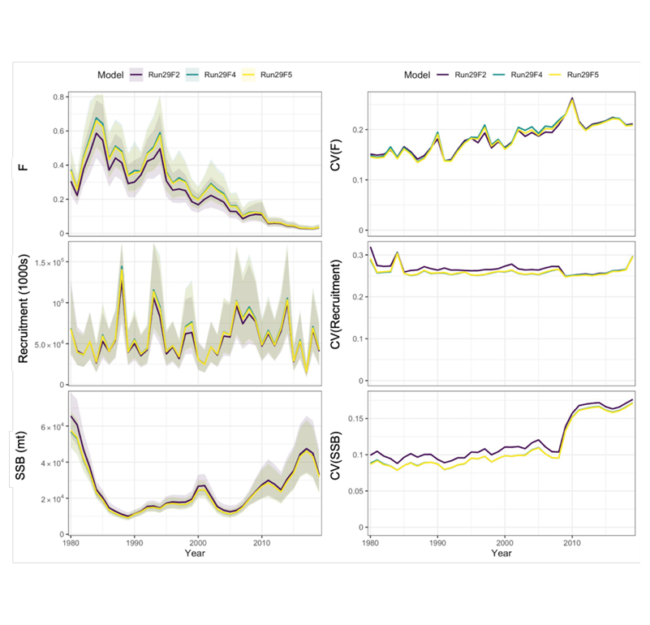
:::

::::::: publication-content
::: publication-title
[A state-space assessment of American plaice using the Woods Hole Assessment Model (WHAM). Working Paper 18. American Plaice Research Track Stock Assessment](https://apps-nefsc.fisheries.noaa.gov/saw/sasi_files.php?year=2022&species_id=2&stock_id=4&review_type_id=5&info_type_id=5&map_type_id=&filename=WP18%20Hart%20etal%20WHAM.pdfhttps://apps-nefsc.fisheries.noaa.gov/saw/sasi_files.php?year=2022&species_id=2&stock_id=4&review_type_id=5&info_type_id=5&map_type_id=&filename=WP16%20Behan%20_%20Kerr%20Ecosystem%20Drivers.pdf)
:::

::: publication-year
2022
:::

::: publication-authors
Hart A, Kerr L, Miller T
:::
:::::::
:::::::::